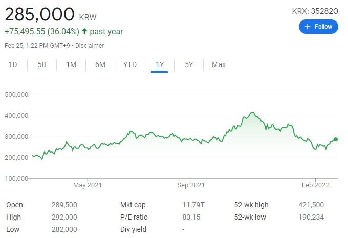

# The Impact on the Popularity of BTS on the stock price of HYBE
This project started with the question **“Does the popularity of the products of the company have an impact on the stock price of that company?”**

But it wouldn’t be feasible to analyze every industry or every company, so I did the case study with this specific entertainment company, HYBE, which is a management agency of BTS. I chose this company not because I’m a fan of them, but because I worked for this company for a year as a business analyst and the question above was one of what I was always asked about.

 

There are 1 response variable and 5 independent variables that I looked into. All variables are on daily basis and numeric. The response variable is the Stock price of the company(`HYBE_stock_price`) and I set the date range from the company’s IPO day to the recent date(`date`). The independent variables are the Kospi index(`kospi_index`), the search volume of company name in Naver (the most used search volume in South Korea, `Ksearch_company`), the search volume of artist name in Naver(`Ksearch_artist`), the search volume of artist name in google(`google_artist`), the streams in spotify(`stream`).

To get the daily music streaming data, I used Python to web-scrape from the Spotify daily charts of top streaming songs for each day. (Python code is [here](./Spotify_chart.ipynb).) Using MySQL, I selected daily summations of stream numbers of BTS’s songs. After importing datasets of other variables and joining those tables based on the date, I got the final data set. (MySQL code is [here](./Preparing_datasets.sql).)

In the Modeling part, I fitted the models with **Multi Linear Regression** and two **Non-parametric Methods**--**Kernel Regression Estimate and Generalized Additive Model**. (R code is [here](./main.md).)

You can also see [the presentation](https://prezi.com/view/4LvnXsjA25EFY3OdzjKb/).
