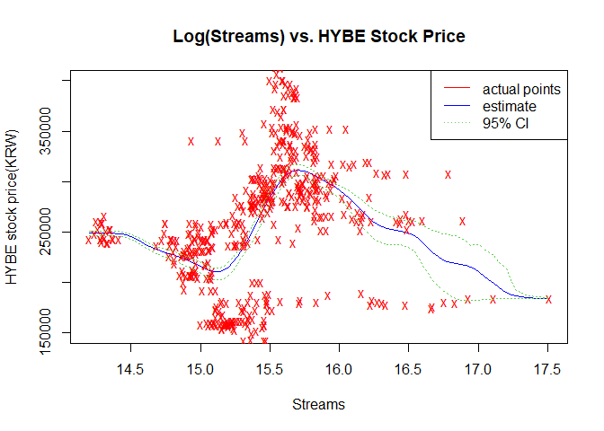

Analysis of the Impact of Popularity of the Product on the stock price
of the Company – A Case Study : BTS and its management company HYBE
================
Yewon Lee

-   [Abstract](#abstract)
-   [1. EDA](#1-eda)
    -   [(1) Import the data](#1-import-the-data)
    -   [(2) Trends of each variable](#2-trends-of-each-variable)
    -   [(3) Histograms & Correlation
        plots](#3-histograms--correlation-plots)
-   [2. Transformation](#2-transformation)
-   [3. Modeling](#3-modeling)
    -   [(1) Linear Model (Multi Linear
        Regression)](#1-linear-model-multi-linear-regression)
    -   [(2) Non-parametric Model](#2-non-parametric-model)
-   [3. Conclusion](#3-conclusion)
    -   [(1) Takeaways](#1-takeaways)
    -   [(2) Improvements](#2-improvements)

# Abstract

This project started with the question **“Does the popularity of the
products of the company have an impact on the stock price of that
company?”**

But it wouldn’t be feasible to analyze every industry or every company,
so I did the case study with this specific entertainment company, HYBE,
which is a management agency of BTS. I chose this company not because
I’m a fan of them, but because I worked for this company for a year as a
business analyst and the question above was one of what I was always
asked about.

There are 1 response variable and 5 independent variables that I looked
into. All variables are on daily basis and numeric. The response
variable is the Stock price of the company(`HYBE_stock_price`) and I set
the date range from the company’s IPO day to the recent date(`date`).
The independent variables are the Kospi index(`kospi_index`), the search
volume of company name in Naver (the most used search volume in South
Korea, `Ksearch_company`), the search volume of artist name in
Naver(`Ksearch_artist`), the search volume of artist name in
google(`google_artist`), the streams in spotify(`stream`).

To get the daily music streaming data, I used Python to web-scrape from
the Spotify daily charts of top streaming songs for each day. (Python
code is
[here](https://github.com/yewonlee5/Impact_of_BTS_on_HYBE_stock_price/blob/main/Spotify_chart.ipynb).)
Using MySQL, I selected daily summations of stream numbers of BTS’s
songs. After importing data sets of other variables and joining those
tables based on the date, I got the final data set. (MySQL code is
[here](https://github.com/yewonlee5/Impact_of_BTS_on_HYBE_stock_price/blob/main/Preparing_datasets.sql).)

In the Modeling part, I fitted the models with **Multi Linear
Regression** and two **Non-parametric Methods**–**Kernel Regression
Estimate and Generalized Additive Model**.

# 1. EDA

## (1) Import the data

``` r
library(readr)
```

``` r
data <- read_csv("data_f.csv")
colnames(data) <- c("date", "HYBE_stock_price", "kospi_index", "Ksearch_company",
                    "Ksearch_artist", "google_artist", "stream")
```

## (2) Trends of each variable

``` r
plot(data$date, data$HYBE_stock_price, type="l", yaxt="n", ylab="", ylim=c(0,400000))
lines(data$date, data$kospi_index*100, col="blue")
lines(data$date, data$Ksearch_company*10000, col="red")
lines(data$date, data$Ksearch_artist*10000, col="orange")
lines(data$date, data$google_artist*2000, col="green")
lines(data$date, data$stream/100, col="purple")

legend("top",lty=c(1,1,1,1,1,1), cex=0.5,
       col=c("black","blue","red","orange","green","purple"),
       c("HYBE_stock_price","kospi_index","Ksearch_company",
         "Ksearch_artist","google_artist","stream")) 
```

<!-- -->

-   For the first step of analyzing the data, I created a plot where the
    x-axis is a timeline and the y-axis is the value of every variable.
    Technically this plot isn’t correct at all because the variables
    have all different values for y-axis, so it’s just for checking the
    trends of each variable.

-   The black line indicates dramatic changes in `HYBE_stock_price`. It
    hasn’t been long since the company became public, so the volatility
    of the stock price is extremely high as the consensus of the
    reasonable stock price hasn’t been really settled yet. `kospi_index`
    follows the similar trend as `HYBE_stock_price` does, but it’s much
    more stable. The flows of the search volumes and the streams are
    quite event driven and they peak whenever the new songs are
    released, or the concerts are hosted.

## (3) Histograms & Correlation plots

``` r
library("PerformanceAnalytics")
```

``` r
pairs <- data[, -1] # numeric variables only
chart.Correlation(pairs, histogram=TRUE, pch=19)
```

<!-- -->

-   The highest correlation between the variables is the correlation of
    `HYBE_stock_price` and `kospi_index`, which is to be expected.

-   The distributions of `Ksearch_company`, `Ksearch_artist`,
    `google_artist` and `stream` are right skewed, so these variables
    need to be transformed.

# 2. Transformation

``` r
# Log Transformation
data2 <- data
data2["Ksearch_company"] <- log(data$Ksearch_company)
data2["google_artist"] <- log(data$google_artist)
data2["Ksearch_artist"] <- log(data$Ksearch_artist)
data2["stream"] <- log(data$stream)
attach(data2)

# Histograms & Correlation plots after the transformation
pairs <- data2[, -1] # numeric variables only
chart.Correlation(pairs, histogram=TRUE, pch=19)
```

<!-- -->

-   After the transformation, the distributions seem close to normal
    distribution.

-   There are high collinearities between `Ksearch_company` and
    `Ksearch_artist`, `Ksearch_artist` and `google_artist`,
    `google_artist` and `stream`.

# 3. Modeling

## (1) Linear Model (Multi Linear Regression)

``` r
# Include every dependent variables
model1 <- lm(HYBE_stock_price ~ kospi_index + Ksearch_company
             + Ksearch_artist + google_artist + stream, 
             data = data2)
summary(model1)
```

    ## 
    ## Call:
    ## lm(formula = HYBE_stock_price ~ kospi_index + Ksearch_company + 
    ##     Ksearch_artist + google_artist + stream, data = data2)
    ## 
    ## Residuals:
    ##     Min      1Q  Median      3Q     Max 
    ## -106004  -27016   -6324   15634  182136 
    ## 
    ## Coefficients:
    ##                   Estimate Std. Error t value Pr(>|t|)    
    ## (Intercept)     -727801.25   82223.98  -8.851   <2e-16 ***
    ## kospi_index         107.91      10.29  10.489   <2e-16 ***
    ## Ksearch_company   -4536.61    3031.23  -1.497    0.135    
    ## Ksearch_artist   -72542.47    7441.06  -9.749   <2e-16 ***
    ## google_artist      2124.61   21027.24   0.101    0.920    
    ## stream            48820.41    5055.08   9.658   <2e-16 ***
    ## ---
    ## Signif. codes:  0 '***' 0.001 '**' 0.01 '*' 0.05 '.' 0.1 ' ' 1
    ## 
    ## Residual standard error: 46360 on 483 degrees of freedom
    ## Multiple R-squared:  0.4658, Adjusted R-squared:  0.4603 
    ## F-statistic: 84.24 on 5 and 483 DF,  p-value: < 2.2e-16

-   In this model, `Kospi index`, `Ksearch_artist`, and `stream` are
    significant. Adjusted R-squared is 46.03%, indicating that 46.03% of
    the variance of `HYBE_stock_price` can be explained by the variance
    of independent variables.

-   However, the coefficient of `Ksearch_artist` is negative, which
    means as `Ksearch_artist` increases, `HYBE_stock_price` decreases.
    This seems unreasonable and is probably due to the high skewness of
    the raw data.

``` r
# Include only kospi_index and stream
model2 <- lm(HYBE_stock_price ~ kospi_index + stream, data = data2)
summary(model2)
```

    ## 
    ## Call:
    ## lm(formula = HYBE_stock_price ~ kospi_index + stream, data = data2)
    ## 
    ## Residuals:
    ##     Min      1Q  Median      3Q     Max 
    ## -113737  -29360   -6003   24729  152496 
    ## 
    ## Coefficients:
    ##               Estimate Std. Error t value Pr(>|t|)    
    ## (Intercept) -7.680e+05  8.339e+04  -9.210   <2e-16 ***
    ## kospi_index  1.281e+02  9.999e+00  12.809   <2e-16 ***
    ## stream       4.176e+04  4.908e+03   8.508   <2e-16 ***
    ## ---
    ## Signif. codes:  0 '***' 0.001 '**' 0.01 '*' 0.05 '.' 0.1 ' ' 1
    ## 
    ## Residual standard error: 52360 on 486 degrees of freedom
    ## Multiple R-squared:  0.3143, Adjusted R-squared:  0.3115 
    ## F-statistic: 111.4 on 2 and 486 DF,  p-value: < 2.2e-16

-   In this model, both `Kospi index` and `stream` are significant, but
    adjusted R-squared is 31.15% which is lower than the first model
    with every variable.

``` r
library(car)
```

<!-- -->

-   It doesn’t seem that the relationships between the dependent
    variables and the response variable follow the linear line.

``` r
# Check the model assumptions
par(mfrow=c(2, 2))
plot(model2)
```

<!-- -->

-   The residuals bounce randomly around zero, and there’s no obvious
    pattern. I would say the model does not violate the assumptions of
    constant variance.
-   For the Normal QQ plot, it seems to meet assumptions of normality.
-   There are two outliers calculated by Cook’s distance.

``` r
# Check the outliers
data[c(37:38),]
```

    ## # A tibble: 2 x 7
    ##   date       HYBE_stock_price kospi_index Ksearch_company Ksearch_artist
    ##   <date>                <dbl>       <dbl>           <dbl>          <dbl>
    ## 1 2020-11-20           184500       2554.            3.44          14.2 
    ## 2 2020-11-21           184500       2554.            1.07           7.27
    ## # ... with 2 more variables: google_artist <dbl>, stream <dbl>

-   The outliers occurred in Nov 2020 when ‘Dynamite’, the mega-hit of
    BTS, topped the charts in a dozen of weeks.

## (2) Non-parametric Model

-   After fitting the linear model, I used two non-parametric methods
    with independent variables of `kospi_index`, `google_artist`, and
    `stream` to analyze their impact on the response variable.

-   With the Gaussian Kernel Regression Estimate, I created a plot of
    `HYBE_stock_price` and each independent variable to find the
    non-linear relationship between the variables.

### A. Kernel Regression Estimate using C

``` r
dyn.load("kernreg7.dll")

# C code for Gaussian Kernel Regression Estimate
comment="
  #include <R.h>
  #include <Rmath.h>

  /* x and y will be the data vectors each of length n, 
  b is the bandwidth,
  g2 will be the vector of m gridpoints 
  where we want to calculate the kernel regression estimates,
  res2, which is thus also of length m. 
*/

void kernreg7 (int *n, double *x, double *y, int *m, double *g2, double *b, double *res2)
{
    int i,j;
    double a1,a2;
    for(i = 0; i < *m; i++){
    a1 = 0.0;       // numerator
    a2 = 0.0;   // denominator
    for(j=0; j < *n; j++){
        a1 += dnorm(x[j], g2[i], *b, 0) * y[j];
        a2 += dnorm(x[j], g2[i], *b, 0);
        }
    res2[i] = a1 / a2; 
    }
}
"
```

``` r
# Bandwidth selected using the rule of thumb suggested by Scott
bw1 = bw.nrd(kospi_index)
bw2 = bw.nrd(google_artist)
bw3 = bw.nrd(stream)

# Integer n
n = length(HYBE_stock_price)

# Gridpoints g
m = 100
g1 = seq(summary(kospi_index)[[1]], summary(kospi_index)[[6]], length=m) # seq(min, max, 100)
g2 = seq(summary(google_artist)[[1]], summary(google_artist)[[6]], length=m)
g3 = seq(summary(stream)[[1]], summary(stream)[[6]], length=m)

# Call the C function directly
a = .C("kernreg7", as.integer(n), as.double(kospi_index),
       as.double(HYBE_stock_price), 
       as.integer(m), as.double(g1), as.double(bw1), res2=double(m))

b = .C("kernreg7", as.integer(n), as.double(google_artist),
       as.double(HYBE_stock_price), 
       as.integer(m), as.double(g2), as.double(bw2), res2=double(m))

c = .C("kernreg7", as.integer(n), as.double(stream),
       as.double(HYBE_stock_price), 
       as.integer(m), as.double(g3), as.double(bw3), res2=double(m))


# Iteration for getting the confidence band
set.seed(1)
result1 <- matrix(0, nrow=m, ncol=100)
for (i in 1:100){
  ran <- sample(1:n, 500, replace=T) # n = length(HYBE_stock_price)
  ran_sample <- cbind(kospi_index, HYBE_stock_price)[ran, ]
  bw1 <- bw.nrd(ran_sample[, 1])
  
  a_r = .C("kernreg7", as.integer(500), 
           as.double(ran_sample[, 1]), 
           as.double(ran_sample[, 2]), 
           as.integer(m), as.double(g1), as.double(bw1), 
           res2=double(m))
  
  result1[, i] <- a_r$res2
}

result2 <- matrix(0, nrow=m, ncol=100)
for (i in 1:100){
  ran <- sample(1:n, 500, replace=T) # n = length(HYBE_stock_price)
  ran_sample <- cbind(google_artist, HYBE_stock_price)[ran, ]
  bw2 <- bw.nrd(ran_sample[, 1])
  
  b_r = .C("kernreg7", as.integer(500), 
           as.double(ran_sample[, 1]), 
           as.double(ran_sample[, 2]), 
           as.integer(m), as.double(g2), as.double(bw2), 
           res2=double(m))
  
  result2[, i] <- b_r$res2
}

result3 <- matrix(0, nrow=m, ncol=100)
for (i in 1:100){
  ran <- sample(1:n, 500, replace=T) # n = length(HYBE_stock_price)
  ran_sample <- cbind(stream, HYBE_stock_price)[ran, ]
  bw3 <- bw.nrd(ran_sample[, 1])
  
  c_r = .C("kernreg7", as.integer(500), 
           as.double(ran_sample[, 1]), 
           as.double(ran_sample[, 2]), 
           as.integer(m), as.double(g3), as.double(bw3), 
           res2=double(m))
  
  result3[, i] <- c_r$res2
}

# 2.5th and 97.5th percentile
result1_CI <- apply(result1, 1, quantile, probs=c(0.025, 0.925))
result2_CI <- apply(result2, 1, quantile, probs=c(0.025, 0.925))
result3_CI <- apply(result3, 1, quantile, probs=c(0.025, 0.925))

# plot of estimates with CI vs. actual points
plot(g1, a$res2, type="l", col="blue", main="Kospi Index vs. HYBE Stock Price", 
     xlab="Kospi Index", ylab="HYBE stock price(KRW)", ylim=c(150000, 400000))
points(kospi_index, HYBE_stock_price, pch="x", col="red")
lines(g1, result1_CI[1, ], lty=3, col="3")
lines(g1, result1_CI[2, ], lty=3, col="3")
legend("topleft", lty=c(1,1,3), cex=1, col=c("red", "blue", "3"),
       c("actual points", "estimate", "95% CI")) 
```

<!-- -->

-   In the Kernel Regression Estimate Plot of `kospi_index` and
    `HYBE_stock_price`, `HYBE_stock_price` goes up gradually with the
    increase of `Kospi index`, but there is a concave curve in the range
    of (2800, 3100) of `kospi_index`.

``` r
plot(g2, b$res2, type="l", col="blue", 
     main="Log(Search Volume of artist name in Google) vs. HYBE Stock Price", 
     xlab="Search Volume in artist name in Google", 
     ylab="HYBE stock price(KRW)", ylim=c(150000, 400000))
points(google_artist, HYBE_stock_price, pch="x", col="red")
lines(g2, result2_CI[1, ], lty=3, col="3")
lines(g2, result2_CI[2, ], lty=3, col="3")
legend("bottomright", lty=c(1,1,3), cex=1, col=c("red", "blue", "3"), 
       c("actual points","estimate","95% CI")) 
```

<!-- -->

-   In the Kernel Regression Estimate Plot of `google_artist` and
    `HYBE_stock_price`, most of the actual points are far from the
    confidence band, and the regression line is flat without any
    pattern. This variable doesn’t seem to explain the response variable
    well.

``` r
plot(g3, c$res2, type="l", col="blue", 
     main="Log(Streams) vs. HYBE Stock Price", 
     xlab="Streams", ylab="HYBE stock price(KRW)", 
     ylim=c(150000, 400000))
points(stream, HYBE_stock_price, pch="x", col="red")
lines(g3, result3_CI[1, ], lty=3, col="3")
lines(g3, result3_CI[2, ], lty=3, col="3")
legend("topright", lty=c(1,1,3), cex=1, col=c("red", "blue", "3"), 
       c("actual points","estimate","95% CI")) 
```

<!-- -->

-   In the Kernel Regression Estimate Plot of `stream` and the
    `HYBE_stock_price`, most of the actual points are in the range of
    (3000000, 6000000) (before the transformation) of `stream`. The
    point at the far left side of the plot seems to have a huge impact
    on the decreasing regression line in the range of high streams.

### B. Generalized Additive Model (GAM)

#### a. Kospi index vs. Stock Price of HYBE

``` r
library(gam)
```

-   To find the best Generalized Additive model, we compare polynomial
    models and spline models with different parameters.
-   For all the independent variables of `kospi_index` and , the spline
    models with 3 knots have the least deviance. For `google_artist`,
    the cubic regression model has the least deviance. Below are the
    results and the plots.

``` r
# Quadratic model vs. Cubic model vs. spline models
kospi_poly2 <- gam(HYBE_stock_price ~ poly(kospi_index, 2))
kospi_poly3 <- gam(HYBE_stock_price ~ poly(kospi_index, 3))
kospi_spline2 <- gam(HYBE_stock_price ~ s(kospi_index, df = 2))
kospi_spline4 <- gam(HYBE_stock_price ~ s(kospi_index, df = 4)) # the least deviance

par(mfrow = c(2, 2))
plot(kospi_poly2, main="poly(kospi_index, 2)", se = TRUE)
plot(kospi_poly3, main="poly(kospi_index, 3)", se=TRUE)
plot(kospi_spline2, main="s(kospi_index, df=2)", se=TRUE)
plot(kospi_spline4, main="s(kospi_index, df=4)", se=TRUE) # the least deviance
```

<!-- -->

``` r
anova(kospi_poly2, kospi_poly3, kospi_spline2, kospi_spline4)
```

    ## Analysis of Deviance Table
    ## 
    ## Model 1: HYBE_stock_price ~ poly(kospi_index, 2)
    ## Model 2: HYBE_stock_price ~ poly(kospi_index, 3)
    ## Model 3: HYBE_stock_price ~ s(kospi_index, df = 2)
    ## Model 4: HYBE_stock_price ~ s(kospi_index, df = 4)
    ##   Resid. Df Resid. Dev       Df   Deviance Pr(>Chi)    
    ## 1       486 1.4707e+12                                 
    ## 2       485 1.4625e+12  1.00000 8.2220e+09  0.06359 .  
    ## 3       486 1.4153e+12 -0.99986 4.7148e+10             
    ## 4       484 1.1564e+12  1.99988 2.5892e+11  < 2e-16 ***
    ## ---
    ## Signif. codes:  0 '***' 0.001 '**' 0.01 '*' 0.05 '.' 0.1 ' ' 1

``` r
summary(kospi_spline4)
```

    ## 
    ## Call: gam(formula = HYBE_stock_price ~ s(kospi_index, df = 4))
    ## Deviance Residuals:
    ##     Min      1Q  Median      3Q     Max 
    ## -130348  -22233    1583   27820  127556 
    ## 
    ## (Dispersion Parameter for gaussian family taken to be 2389227203)
    ## 
    ##     Null Deviance: 1.942999e+12 on 488 degrees of freedom
    ## Residual Deviance: 1.156386e+12 on 484 degrees of freedom
    ## AIC: 11954.28 
    ## 
    ## Number of Local Scoring Iterations: NA 
    ## 
    ## Anova for Parametric Effects
    ##                         Df     Sum Sq    Mean Sq F value    Pr(>F)    
    ## s(kospi_index, df = 4)   1 4.1227e+11 4.1227e+11  172.55 < 2.2e-16 ***
    ## Residuals              484 1.1564e+12 2.3892e+09                      
    ## ---
    ## Signif. codes:  0 '***' 0.001 '**' 0.01 '*' 0.05 '.' 0.1 ' ' 1
    ## 
    ## Anova for Nonparametric Effects
    ##                        Npar Df Npar F     Pr(F)    
    ## (Intercept)                                        
    ## s(kospi_index, df = 4)       3 52.227 < 2.2e-16 ***
    ## ---
    ## Signif. codes:  0 '***' 0.001 '**' 0.01 '*' 0.05 '.' 0.1 ' ' 1

``` r
yhat_ks4 <-  predict(kospi_spline4, as.data.frame(kospi_index))
yhat_ks4_sort <- as.data.frame(cbind(kospi_index, yhat_ks4))[order(kospi_index), ]
par(mfrow = c(1, 1))
plot(kospi_index, HYBE_stock_price, pch="x", col="red", main="s(kospi_index, df=4)")
lines(yhat_ks4_sort[, 1], yhat_ks4_sort[, 2])
legend("topleft",lty=c(1,1), cex=1, 
       col=c("black", "red"),c("fitted points","actual points"))
```

<!-- -->

-   The points at the bottom of the plot indicate that this stock was
    relatively low valuated at the point of IPO.
-   The points above the line show the stock price was relatively high.
    It was when the company announced it would invest in an NFT
    business.

#### b. Search Volume of artist name in Google vs. Stock Price of HYBE

  

``` r
g_artist_poly2 <- gam(HYBE_stock_price ~ poly(google_artist, 2))
g_artist_poly3 <- gam(HYBE_stock_price ~ poly(google_artist, 3)) # the least deviance
g_artist_spline2 <- gam(HYBE_stock_price ~ s(google_artist, df = 2))
g_artist_spline4 <- gam(HYBE_stock_price ~ s(google_artist, df = 4))

par(mfrow = c(2, 2))
plot(g_artist_poly2, main="poly(Log(google_artist), 2)", se = TRUE)
plot(g_artist_poly3, main="poly(Log(google_artist), 3)", se=TRUE) # the least deviance
plot(g_artist_spline2, main="s(Log(google_artist), df=2)", se=TRUE)
plot(g_artist_spline4, main="s(Log(google_artist), df=4)", se=TRUE)
```

<!-- -->

``` r
anova(g_artist_poly2, g_artist_poly3, g_artist_spline2, g_artist_spline4)
```

    ## Analysis of Deviance Table
    ## 
    ## Model 1: HYBE_stock_price ~ poly(google_artist, 2)
    ## Model 2: HYBE_stock_price ~ poly(google_artist, 3)
    ## Model 3: HYBE_stock_price ~ s(google_artist, df = 2)
    ## Model 4: HYBE_stock_price ~ s(google_artist, df = 4)
    ##   Resid. Df Resid. Dev       Df    Deviance Pr(>Chi)  
    ## 1       486 1.8846e+12                                
    ## 2       485 1.8672e+12  1.00000  1.7382e+10  0.03311 *
    ## 3       486 1.8781e+12 -0.99998 -1.0876e+10  0.09191 .
    ## 4       484 1.8531e+12  1.99996  2.4995e+10  0.03822 *
    ## ---
    ## Signif. codes:  0 '***' 0.001 '**' 0.01 '*' 0.05 '.' 0.1 ' ' 1

``` r
summary(g_artist_poly3)
```

    ## 
    ## Call: gam(formula = HYBE_stock_price ~ poly(google_artist, 3))
    ## Deviance Residuals:
    ##     Min      1Q  Median      3Q     Max 
    ## -120230  -38804    1982   35746  164444 
    ## 
    ## (Dispersion Parameter for gaussian family taken to be 3849852385)
    ## 
    ##     Null Deviance: 1.942999e+12 on 488 degrees of freedom
    ## Residual Deviance: 1.867178e+12 on 485 degrees of freedom
    ## AIC: 12186.57 
    ## 
    ## Number of Local Scoring Iterations: 2 
    ## 
    ## Anova for Parametric Effects
    ##                         Df     Sum Sq    Mean Sq F value    Pr(>F)    
    ## poly(google_artist, 3)   3 7.5821e+10 2.5274e+10  6.5648 0.0002342 ***
    ## Residuals              485 1.8672e+12 3.8499e+09                      
    ## ---
    ## Signif. codes:  0 '***' 0.001 '**' 0.01 '*' 0.05 '.' 0.1 ' ' 1

``` r
yhat_gp3 <-  predict(g_artist_poly3, as.data.frame(google_artist))
yhat_gp3_sort <- as.data.frame(cbind(google_artist, yhat_gp3))[order(google_artist), ]
par(mfrow = c(1, 1))
plot(google_artist, HYBE_stock_price, pch="x", col="red", main="poly(Log(google_artist), 3)")
lines(yhat_gp3_sort[, 1], yhat_gp3_sort[, 2])
legend("topright",lty=c(1,1), cex=1, col=c("black", "red"),c("fitted points","actual points")) 
```

<!-- -->

-   The variance seems large at each value of the
    `search volume of artist in Google` and the line looks flat. The
    model doesn’t seem to fit the data well.

#### c. Streams vs. Stock Price of HYBE

  

``` r
stream_poly2 <- gam(HYBE_stock_price ~ poly(stream, 2))
stream_poly3 <- gam(HYBE_stock_price ~ poly(stream, 3))
stream_spline2 <- gam(HYBE_stock_price ~ s(stream, df = 2))
stream_spline4 <- gam(HYBE_stock_price ~ s(stream, df = 4)) # the least deviance

par(mfrow = c(2, 2))
plot(stream_poly2, main="poly(Log(stream), 2)", se = TRUE)
plot(stream_poly3, main="poly(Log(stream), 3)", se=TRUE)
plot(stream_spline2, main="s(Log(stream), df=2)", se=TRUE)
plot(stream_spline4, main="s(Log(stream), df=4)", se=TRUE) # the least deviance
```

<!-- -->

``` r
anova(stream_poly2, stream_poly3, stream_spline2, stream_spline4)
```

    ## Analysis of Deviance Table
    ## 
    ## Model 1: HYBE_stock_price ~ poly(stream, 2)
    ## Model 2: HYBE_stock_price ~ poly(stream, 3)
    ## Model 3: HYBE_stock_price ~ s(stream, df = 2)
    ## Model 4: HYBE_stock_price ~ s(stream, df = 4)
    ##   Resid. Df Resid. Dev      Df    Deviance  Pr(>Chi)    
    ## 1       486 1.7096e+12                                  
    ## 2       485 1.4974e+12  1.0000  2.1218e+11 < 2.2e-16 ***
    ## 3       486 1.5258e+12 -1.0000 -2.8453e+10 0.0006539 ***
    ## 4       484 1.1855e+12  2.0002  3.4030e+11 < 2.2e-16 ***
    ## ---
    ## Signif. codes:  0 '***' 0.001 '**' 0.01 '*' 0.05 '.' 0.1 ' ' 1

``` r
summary(stream_spline4)
```

    ## 
    ## Call: gam(formula = HYBE_stock_price ~ s(stream, df = 4))
    ## Deviance Residuals:
    ##     Min      1Q  Median      3Q     Max 
    ## -130823  -22338    7643   27171  129168 
    ## 
    ## (Dispersion Parameter for gaussian family taken to be 2449465035)
    ## 
    ##     Null Deviance: 1.942999e+12 on 488 degrees of freedom
    ## Residual Deviance: 1.185541e+12 on 483.9998 degrees of freedom
    ## AIC: 11966.45 
    ## 
    ## Number of Local Scoring Iterations: NA 
    ## 
    ## Anova for Parametric Effects
    ##                    Df     Sum Sq    Mean Sq F value    Pr(>F)    
    ## s(stream, df = 4)   1 1.6092e+11 1.6092e+11  65.695 4.339e-15 ***
    ## Residuals         484 1.1855e+12 2.4495e+09                      
    ## ---
    ## Signif. codes:  0 '***' 0.001 '**' 0.01 '*' 0.05 '.' 0.1 ' ' 1
    ## 
    ## Anova for Nonparametric Effects
    ##                   Npar Df Npar F     Pr(F)    
    ## (Intercept)                                   
    ## s(stream, df = 4)       3 81.175 < 2.2e-16 ***
    ## ---
    ## Signif. codes:  0 '***' 0.001 '**' 0.01 '*' 0.05 '.' 0.1 ' ' 1

``` r
yhat_ss4 <-  predict(stream_spline4, as.data.frame(stream))
yhat_ss4_sort <- as.data.frame(cbind(stream, yhat_ss4))[order(stream), ]
par(mfrow = c(1, 1))
plot(stream, HYBE_stock_price, pch="x", col="red",
     main="s(Log(stream), df=4)")
lines(yhat_ss4_sort[, 1], yhat_ss4_sort[, 2])
legend("topright",lty=c(1,1), cex=1, col=c("black", "red"),
       c("fitted points","actual points")) 
```

<!-- -->

-   The extreme point at the far right of the plot heavily influences on
    the regression line. It was when Dynamite topped the chart in fall
    of 2020.

#### d. Compare the GAM models

``` r
kospi_google <- gam(HYBE_stock_price ~ s(kospi_index, df = 4)
                    + poly(google_artist, df = 3))
kospi_stream <- gam(HYBE_stock_price ~ s(kospi_index, df = 4)
                    + s(stream, df = 4)) # the least deviance
kospi_google_stream <- gam(HYBE_stock_price 
                           ~ s(kospi_index, df = 4) 
                           + poly(google_artist, df = 3) 
                           + s(stream, df = 4))

anova(kospi_spline4, kospi_google, kospi_stream, kospi_google_stream)
```

    ## Analysis of Deviance Table
    ## 
    ## Model 1: HYBE_stock_price ~ s(kospi_index, df = 4)
    ## Model 2: HYBE_stock_price ~ s(kospi_index, df = 4) + poly(google_artist, 
    ##     df = 3)
    ## Model 3: HYBE_stock_price ~ s(kospi_index, df = 4) + s(stream, df = 4)
    ## Model 4: HYBE_stock_price ~ s(kospi_index, df = 4) + poly(google_artist, 
    ##     df = 3) + s(stream, df = 4)
    ##   Resid. Df Resid. Dev     Df   Deviance  Pr(>Chi)    
    ## 1       484 1.1564e+12                                
    ## 2       481 1.1202e+12 3.0000 3.6148e+10 2.437e-06 ***
    ## 3       480 6.4549e+11 1.0002 4.7474e+11 < 2.2e-16 ***
    ## 4       477 5.9818e+11 3.0000 4.7317e+10 3.222e-08 ***
    ## ---
    ## Signif. codes:  0 '***' 0.001 '**' 0.01 '*' 0.05 '.' 0.1 ' ' 1

-   Among the combinations of the models chosen, the additive model of
    `kospi_index` and `stream` has the least deviance.

#### e. 2-dimensional plot of the final GAM model

  

``` r
yhat_ss4 <-  predict(kospi_stream, as.data.frame(cbind(kospi_index, stream))) # fitted value of kospi_stream model

actual <- as.data.frame(cbind(kospi_index,stream,HYBE_stock_price))
final <- as.data.frame(cbind(kospi_index,stream,yhat_ss4))

library(ggplot2)
ggplot(final, aes(x=kospi_index, y=stream) ) +
  geom_bin2d(bins=70) +
  scale_fill_gradient2(low="yellow", high="blue") +
  theme_bw() +
  geom_point(actual, mapping = aes(x=kospi_index, y=stream), col="red", size=0.3) +
  labs(title ="Two Dimensional plot of Stock Price by Kospi Index and Streams")
```

<!-- -->

-   With this final model, above is the 2-dimensional plot with the
    purple shades indicating fitted values and the red points indicating
    actual values.

# 3. Conclusion

## (1) Takeaways

-   The Kospi Index seems to have an overall impact on the stock price
    of the company, as it accounts for some portion of changes in the
    individual stock price.

-   Streams, the indicator of the popularity of the artist, appears to
    have a limited impact on the stock price, as it gives rise to
    expectations of better financial performances of the company.

-   The indicators of the search volume are no likely to have
    significant impacts on the stock price, as the raw data sets are
    highly right skewed (the impact of the IPO on the search volume was
    too large). Also, it is possibly because the corporate investors are
    much more influential than individual stockholders in the Korean
    stock market.

## (2) Improvements

-   Every variable has time information (date), so we could use time
    series analysis after getting accumulative and longer data sets. I
    tried to apply the time series methods as well, but I couldn’t draw
    any meaningful result from this data since the timeline is too short
    (489 days) to figure out the seasonality and patterns.

-   We could use other popularity-related data sets as independent
    variables from various platforms, such as YouTube, Twitter, Airplay
    and etc. if their daily figures become accessible.

-   Variables of search volume themselves do not have information about
    whether they are from positive or negative keywords. Text sentiment
    analysis can be another meaningful method with text data scrapped
    from the news articles, search keywords and comments.
