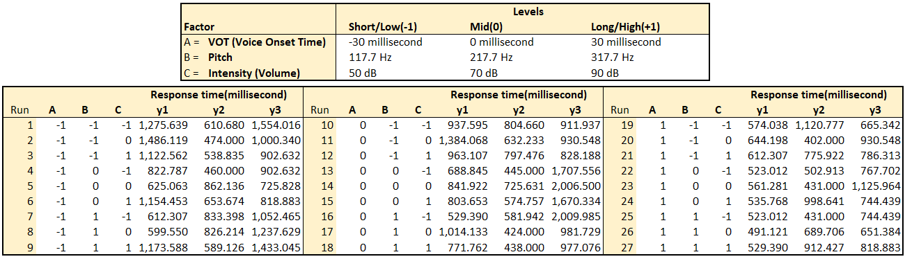

# Phonetic Factor Effects on the Perception of Sound

Have you ever thought about what makes the sound confusing when we hear stop consonant sounds? Stop consonants (also known as plosive consonants) are made by blocking the flow of air as it leaves the body, normally followed by releasing the air. There are 6 stop consonants in English pronunciation : *p/b, t/d, k/g*. Each pair differs from each other in the place of sound production, and the two stop consonants in each pair differ in their voicing: one of them is voiced, while the other is voiceless.

*source : https://thesoundofenglish.org/plosives/*

## Here’s the example of confusing stop consonants!

Did you get what she said? The first word was “*timing*” and the second word was “*diamond*”. In the similar cases, you can possibly distinguish them from the context, but it is more tough to do that for the non-native English speakers like me.

## Experimental Design

To figure out which phonetic factors most affect on the perception of sound and which levels make it most confusing, I designed the experiment and applied a **3X3 full factorial design** and made 3 replicates from three independent respondents. The dependent variable is the response time, which is the time duration between the participants' hearing the sound and answering to it.

The three factors are **Voice on time, Pitch, and Intensity**. The Voice Onset Time (VOT) is the difference in time between releasing and voicing. Pitch refers to the volume of sound. Intensity is defined as the power per unit area carried by the sound wave.

I adopted a professional software called **Praat** specialized in visualizing and manipulating the aforementioned factors of interest. In the experience, a sound that can be perceived as */pa/* as was recorded and used to create 27 samples by manipulating three factors. If a pronunciation has positive VOT, release starts before voicing; if a pronunciation has the negative VOT, release starts after voicing, so there will be a part of prevoicing in the recording. Intensity is illustrated by the yellow curve on (a), (b), (c) and the amplitude of frequency band changes proportionally as intensity changes. Pitch is illustrated by the blue curve on aforementioned graphs, and the spacing between the sibilants and fricatives, which are represented by the dark vertical lines in the plot, becomes more crowded as pitch increases. Besides these three factors, there is a block predictor of each participant.

1. Voice On Time

*source : https://www.mq.edu.au/about/about-the-university/our-faculties/medicine-and-health-sciences/departments-and-centres/department-of-linguistics/our-research/phonetics-and-phonology/speech/acoustics/speech-waveforms/the-waveforms-of-speech*

2. Manipulation of Pitch and Intensity

## Data

The table below shows the data from the experiment. The responses are from three different respondents, and the actual run orders were randomized for each respondent. In order to prevent the learning effects, five fake questions were put at the beginning of the experiment for each respondent, which were randomly selected from the 27 sound samples.

The goal is to learn which factor among VOT, pitch, and intensity affects people’s response time the most. Here is [the full code and description of the analysis using R](./main.md), including the conclusion and the possible improvements.

You can also see [the presentation](https://prezi.com/view/1Xlo63w6VI82Hif5afEA/).
