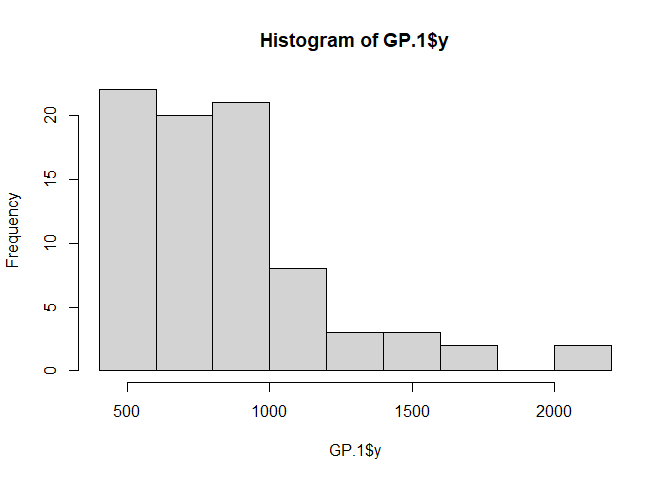
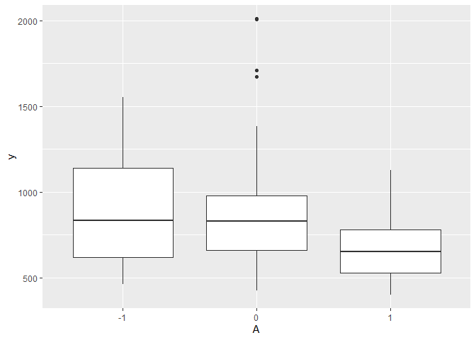
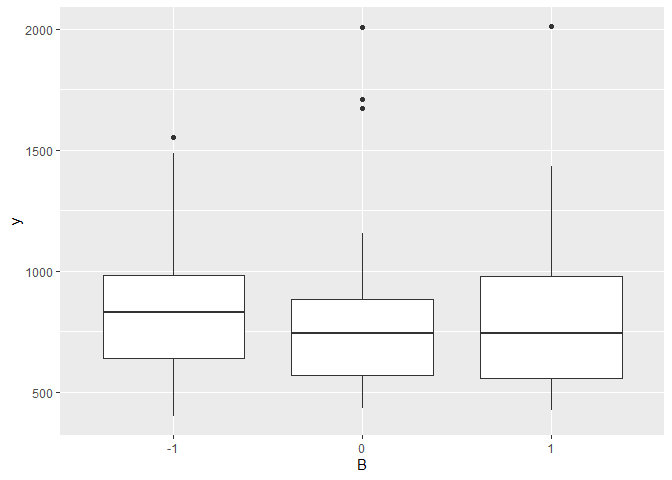
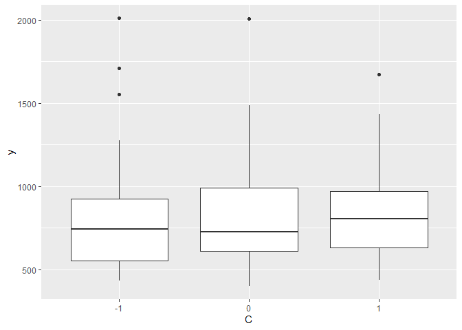
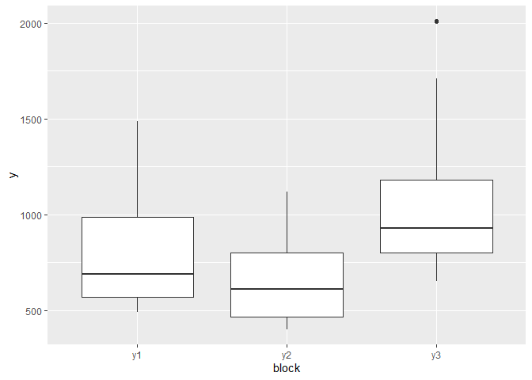
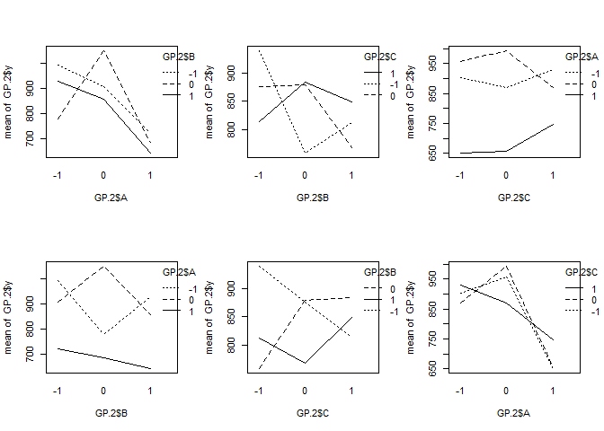
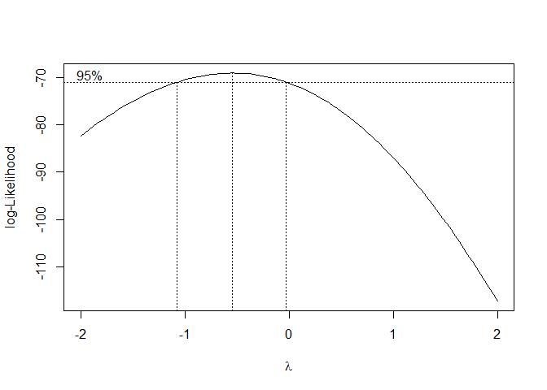
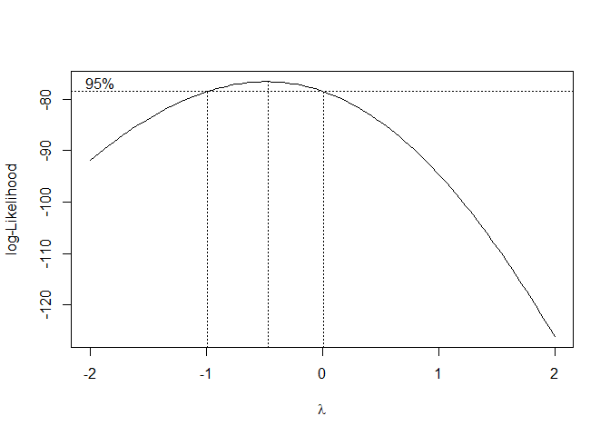
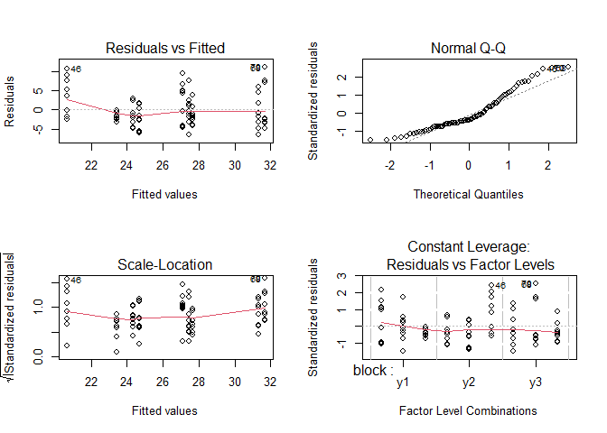

Phonetic Factor Effects on the Perception of Sound
================
Yewon Lee
2021 12 10

``` r
library(readxl)
GP <- read_excel("data.xlsx")
library(tidyr)
GP.1 <- gather(GP, "block", "y", 5:7)
```

# 1. EDA

``` r
# Histogram
hist(GP.1$y)
```

<!-- -->

``` r
library(ggplot2)
```

``` r
# Boxplots
GP.2 <- GP.1
GP.2$A <- as.factor(GP.2$A)
GP.2$B <- as.factor(GP.2$B)
GP.2$C <- as.factor(GP.2$C)
GP.2$block <- as.factor(GP.2$block)

ggplot(GP.2, aes(x=A, y=y)) + 
  geom_boxplot()
```

<!-- -->

``` r
ggplot(GP.2, aes(x=B, y=y)) + 
  geom_boxplot()
```

<!-- -->

``` r
ggplot(GP.2, aes(x=C, y=y)) + 
  geom_boxplot()
```

<!-- -->

``` r
ggplot(GP.2, aes(x=block, y=y)) + 
  geom_boxplot()
```

<!-- -->

``` r
# Interaction Plots
par(mfrow=c(2,3))
interaction.plot(GP.2$A, GP.2$B, GP.2$y)
interaction.plot(GP.2$B, GP.2$C, GP.2$y)
interaction.plot(GP.2$C, GP.2$A, GP.2$y)
interaction.plot(GP.2$B, GP.2$A, GP.2$y)
interaction.plot(GP.2$C, GP.2$B, GP.2$y)
interaction.plot(GP.2$A, GP.2$C, GP.2$y)
```

<!-- -->

# 2. Modeling

## (a) Fit a full linear model

``` r
str(GP.2)
```

    ## tibble [81 x 6] (S3: tbl_df/tbl/data.frame)
    ##  $ num  : num [1:81] 1 2 3 4 5 6 7 8 9 10 ...
    ##  $ A    : Factor w/ 3 levels "-1","0","1": 1 1 1 1 1 1 1 1 1 2 ...
    ##  $ B    : Factor w/ 3 levels "-1","0","1": 1 1 1 2 2 2 3 3 3 1 ...
    ##  $ C    : Factor w/ 3 levels "-1","0","1": 1 2 3 1 2 3 1 2 3 1 ...
    ##  $ block: Factor w/ 3 levels "y1","y2","y3": 1 1 1 1 1 1 1 1 1 1 ...
    ##  $ y    : num [1:81] 1276 1486 1123 823 625 ...

``` r
g <- lm(y~block+A*B*C, GP.2)
anova(g)
```

    ## Analysis of Variance Table
    ## 
    ## Response: y
    ##           Df  Sum Sq Mean Sq F value    Pr(>F)    
    ## block      2 2434810 1217405 12.0821 4.904e-05 ***
    ## A          2 1022119  511060  5.0720  0.009721 ** 
    ## B          2   59499   29749  0.2952  0.745587    
    ## C          2    2116    1058  0.0105  0.989556    
    ## A:B        4  367782   91946  0.9125  0.463661    
    ## A:C        4  138659   34665  0.3440  0.846964    
    ## B:C        4  189355   47339  0.4698  0.757606    
    ## A:B:C      8  327437   40930  0.4062  0.911951    
    ## Residuals 52 5239559  100761                      
    ## ---
    ## Signif. codes:  0 '***' 0.001 '**' 0.01 '*' 0.05 '.' 0.1 ' ' 1

``` r
summary(g)
```

    ## 
    ## Call:
    ## lm(formula = y ~ block + A * B * C, data = GP.2)
    ## 
    ## Residuals:
    ##     Min      1Q  Median      3Q     Max 
    ## -476.22 -189.35  -53.44  140.19  741.94 
    ## 
    ## Coefficients:
    ##             Estimate Std. Error t value Pr(>|t|)    
    ## (Intercept)  1111.95     189.93   5.854 3.27e-07 ***
    ## blocky2      -157.95      86.39  -1.828  0.07326 .  
    ## blocky3       262.43      86.39   3.038  0.00372 ** 
    ## A0           -262.05     259.18  -1.011  0.31667    
    ## A1           -360.06     259.18  -1.389  0.17068    
    ## B0           -418.31     259.18  -1.614  0.11259    
    ## B1           -314.05     259.18  -1.212  0.23109    
    ## C0           -159.96     259.18  -0.617  0.53981    
    ## C1           -292.10     259.18  -1.127  0.26490    
    ## A0:B0         480.71     366.53   1.311  0.19545    
    ## A1:B0         229.46     366.53   0.626  0.53403    
    ## A0:B1         469.76     366.53   1.282  0.20566    
    ## A1:B1          93.49     366.53   0.255  0.79969    
    ## A0:C0         257.51     366.53   0.703  0.48547    
    ## A1:C0          32.15     366.53   0.088  0.93043    
    ## A0:C1         270.29     366.53   0.737  0.46417    
    ## A1:C1         230.23     366.53   0.628  0.53267    
    ## B0:C0         169.16     366.53   0.462  0.64635    
    ## B1:C0         215.03     366.53   0.587  0.55997    
    ## B0:C1         439.30     366.53   1.199  0.23615    
    ## B1:C1         524.63     366.53   1.431  0.15832    
    ## A0:B0:C0      -22.50     518.36  -0.043  0.96555    
    ## A1:B0:C0       66.85     518.36   0.129  0.89789    
    ## A0:B1:C0     -546.40     518.36  -1.054  0.29671    
    ## A1:B1:C0      -42.64     518.36  -0.082  0.93475    
    ## A0:B0:C1     -348.38     518.36  -0.672  0.50451    
    ## A1:B0:C1     -215.69     518.36  -0.416  0.67905    
    ## A0:B1:C1     -814.32     518.36  -1.571  0.12226    
    ## A1:B1:C1     -275.34     518.36  -0.531  0.59755    
    ## ---
    ## Signif. codes:  0 '***' 0.001 '**' 0.01 '*' 0.05 '.' 0.1 ' ' 1
    ## 
    ## Residual standard error: 317.4 on 52 degrees of freedom
    ## Multiple R-squared:  0.4643, Adjusted R-squared:  0.1759 
    ## F-statistic:  1.61 on 28 and 52 DF,  p-value: 0.06833


-   Factor A and block effect are significant.

## (a-1) Box-Cox transformation
### (a-1) Box-Cox transformation

``` r
library(MASS)
```

``` r
bc <- boxcox(g)
```

<!-- -->

``` r
lambda <- bc$x[which.max(bc$y)]
print(lambda)
```

    ## [1] -0.5454545

``` r
GP.2$yt <- GP.2$y^(0.5)-1/(0.5)
```

-   The box-cox method suggests *λ* = -0.55. For better interpretation,
    I take *λ* = -0.5, which means the inverse square root
    transformation.

### (a-2) Linear model after the transformation

``` r
gt <- lm(yt~block+A*B*C, GP.2)
anova(gt)
```

    ## Analysis of Variance Table
    ## 
    ## Response: yt
    ##           Df  Sum Sq Mean Sq F value    Pr(>F)    
    ## block      2  675.41  337.70 13.3697 2.066e-05 ***
    ## A          2  269.60  134.80  5.3368  0.007796 ** 
    ## B          2   23.73   11.86  0.4697  0.627797    
    ## C          2    3.86    1.93  0.0764  0.926556    
    ## A:B        4   75.94   18.99  0.7516  0.561467    
    ## A:C        4   37.25    9.31  0.3686  0.829885    
    ## B:C        4   51.30   12.83  0.5078  0.730209    
    ## A:B:C      8   66.58    8.32  0.3295  0.950862    
    ## Residuals 52 1313.46   25.26                      
    ## ---
    ## Signif. codes:  0 '***' 0.001 '**' 0.01 '*' 0.05 '.' 0.1 ' ' 1

``` r
summary(gt)
```

    ## 
    ## Call:
    ## lm(formula = yt ~ block + A * B * C, data = GP.2)
    ## 
    ## Residuals:
    ##     Min      1Q  Median      3Q     Max 
    ## -7.1598 -3.2848 -0.5517  2.4457 10.4232 
    ## 
    ## Coefficients:
    ##              Estimate Std. Error t value Pr(>|t|)    
    ## (Intercept)  30.79635    3.00721  10.241 4.54e-14 ***
    ## blocky2      -2.78141    1.36785  -2.033  0.04713 *  
    ## blocky3       4.24138    1.36785   3.101  0.00311 ** 
    ## A0           -3.55468    4.10356  -0.866  0.39034    
    ## A1           -5.53924    4.10356  -1.350  0.18291    
    ## B0           -6.55778    4.10356  -1.598  0.11609    
    ## B1           -4.59795    4.10356  -1.120  0.26766    
    ## C0           -2.63304    4.10356  -0.642  0.52392    
    ## C1           -4.36258    4.10356  -1.063  0.29264    
    ## A0:B0         6.38393    5.80331   1.100  0.27638    
    ## A1:B0         3.14821    5.80331   0.542  0.58980    
    ## A0:B1         5.52455    5.80331   0.952  0.34552    
    ## A1:B1         0.49231    5.80331   0.085  0.93272    
    ## A0:C0         3.85544    5.80331   0.664  0.50940    
    ## A1:C0         0.20123    5.80331   0.035  0.97247    
    ## A0:C1         3.98486    5.80331   0.687  0.49535    
    ## A1:C1         3.49930    5.80331   0.603  0.54914    
    ## B0:C0         3.00934    5.80331   0.519  0.60627    
    ## B1:C0         3.41785    5.80331   0.589  0.55845    
    ## B0:C1         7.02415    5.80331   1.210  0.23161    
    ## B1:C1         7.80590    5.80331   1.345  0.18444    
    ## A0:B0:C0     -0.20376    8.20712  -0.025  0.98029    
    ## A1:B0:C0      1.09070    8.20712   0.133  0.89479    
    ## A0:B1:C0     -7.37209    8.20712  -0.898  0.37319    
    ## A1:B1:C0      0.02441    8.20712   0.003  0.99764    
    ## A0:B0:C1     -5.13672    8.20712  -0.626  0.53413    
    ## A1:B0:C1     -3.15096    8.20712  -0.384  0.70260    
    ## A0:B1:C1    -11.42736    8.20712  -1.392  0.16974    
    ## A1:B1:C1     -3.30375    8.20712  -0.403  0.68893    
    ## ---
    ## Signif. codes:  0 '***' 0.001 '**' 0.01 '*' 0.05 '.' 0.1 ' ' 1
    ## 
    ## Residual standard error: 5.026 on 52 degrees of freedom
    ## Multiple R-squared:  0.4782, Adjusted R-squared:  0.1972 
    ## F-statistic: 1.702 on 28 and 52 DF,  p-value: 0.04835


-   Factor A and block effect are significant. (the same result with the
    full linear model before the transformation)

# (b) Orthogonal polynomial contrasts
## (b) Orthogonal polynomial contrasts


``` r
GP.2$A <- as.ordered(GP.2$A)
str(GP.2)
```

    ## tibble [81 x 7] (S3: tbl_df/tbl/data.frame)
    ##  $ num  : num [1:81] 1 2 3 4 5 6 7 8 9 10 ...
    ##  $ A    : Ord.factor w/ 3 levels "-1"<"0"<"1": 1 1 1 1 1 1 1 1 1 2 ...
    ##  $ B    : Factor w/ 3 levels "-1","0","1": 1 1 1 2 2 2 3 3 3 1 ...
    ##  $ C    : Factor w/ 3 levels "-1","0","1": 1 2 3 1 2 3 1 2 3 1 ...
    ##  $ block: Factor w/ 3 levels "y1","y2","y3": 1 1 1 1 1 1 1 1 1 1 ...
    ##  $ y    : num [1:81] 1276 1486 1123 823 625 ...
    ##  $ yt   : num [1:81] 33.7 36.6 31.5 26.7 23 ...

``` r
go <- lm(y~block+A, GP.2)
anova(go)
```

    ## Analysis of Variance Table
    ## 
    ## Response: y
    ##           Df  Sum Sq Mean Sq F value    Pr(>F)    
    ## block      2 2434810 1217405 14.6295 4.218e-06 ***
    ## A          2 1022119  511060  6.1414   0.00337 ** 
    ## Residuals 76 6324407   83216                      
    ## ---
    ## Signif. codes:  0 '***' 0.001 '**' 0.01 '*' 0.05 '.' 0.1 ' ' 1

``` r
summary(go)
```

    ## 
    ## Call:
    ## lm(formula = y ~ block + A, data = GP.2)
    ## 
    ## Residuals:
    ##     Min      1Q  Median      3Q     Max 
    ## -403.54 -185.95  -90.17  117.23  842.31 
    ## 
    ## Coefficients:
    ##             Estimate Std. Error t value Pr(>|t|)    
    ## (Intercept)   807.43      55.52  14.544  < 2e-16 ***
    ## blocky2      -157.95      78.51  -2.012  0.04779 *  
    ## blocky3       262.43      78.51   3.343  0.00129 ** 
    ## A.L          -153.31      55.52  -2.762  0.00721 ** 
    ## A.Q          -119.80      55.52  -2.158  0.03410 *  
    ## ---
    ## Signif. codes:  0 '***' 0.001 '**' 0.01 '*' 0.05 '.' 0.1 ' ' 1
    ## 
    ## Residual standard error: 288.5 on 76 degrees of freedom
    ## Multiple R-squared:  0.3534, Adjusted R-squared:  0.3194 
    ## F-statistic: 10.39 on 4 and 76 DF,  p-value: 9.181e-07


-   31.94% of the variance of the data can be explained by the model
    above.

## (b-1) Box-Cox transformation
### (b-1) Box-Cox transformation

``` r
bc2 <- boxcox(go)
```

<!-- -->

``` r
lambda2 <- bc2$x[which.max(bc2$y)]
print(lambda2)
```

    ## [1] -0.4646465

-   The box-cox method suggests *λ* = -0.46. For better interpretation,
    I take *λ* = -0.5, which means the inverse square root
    transformation.

### (b-2) Orthogonal polynomial contrasts after the transformation

``` r
got <- lm(yt~block+A, GP.2)
anova(got)
```

    ## Analysis of Variance Table
    ## 
    ## Response: yt
    ##           Df  Sum Sq Mean Sq F value    Pr(>F)    
    ## block      2  675.41  337.70 16.3254 1.264e-06 ***
    ## A          2  269.60  134.80  6.5167  0.002443 ** 
    ## Residuals 76 1572.11   20.69                      
    ## ---
    ## Signif. codes:  0 '***' 0.001 '**' 0.01 '*' 0.05 '.' 0.1 ' ' 1

``` r
summary(got)
```

    ## 
    ## Call:
    ## lm(formula = yt ~ block + A, data = GP.2)
    ## 
    ## Residuals:
    ##    Min     1Q Median     3Q    Max 
    ## -6.445 -3.114 -1.615  2.417 11.138 
    ## 
    ## Coefficients:
    ##             Estimate Std. Error t value Pr(>|t|)    
    ## (Intercept)  25.9947     0.8753  29.698  < 2e-16 ***
    ## blocky2      -2.7814     1.2379  -2.247  0.02754 *  
    ## blocky3       4.2414     1.2379   3.426  0.00099 ***
    ## A.L          -2.6061     0.8753  -2.977  0.00390 ** 
    ## A.Q          -1.7871     0.8753  -2.042  0.04465 *  
    ## ---
    ## Signif. codes:  0 '***' 0.001 '**' 0.01 '*' 0.05 '.' 0.1 ' ' 1
    ## 
    ## Residual standard error: 4.548 on 76 degrees of freedom
    ## Multiple R-squared:  0.3754, Adjusted R-squared:  0.3426 
    ## F-statistic: 11.42 on 4 and 76 DF,  p-value: 2.605e-07


-   34.26% of the variance of the data can be explained by the model
    above. (slightly increased comparing to the model before the
    transformation)

-   The orthogonal polynomials are<br/>
    <br/>
    <br/>
<br/>

-   The final model is<br/>
    <br/>
    <br/>

# 3. Model adequacy

``` r
par(mfrow=c(2,2))
plot(got) #final model
```

<!-- --> 
<br/>
- The residuals bounce randomly around zero, and there’s no obvious pattern. I
would say the model does not violate the assumptions of constant
variance. 
- For the Normal QQ plot, it seems to meet assumptions of
normality. 
- We don’t see any outliers.

# 4. Conclusion

-   Voice Onset Time along with its quadratic effect is the one and only
    significant factor in determining the response time.
-   There are no significant interaction effects.

# 5. Possible Improvements

-   Add other possible factors to the experiment design, such as voice
    of different genders.
-   Pick native English speakers and non-native English speakers
    altogether as respondents and set it as a block.
-   Use other stop consonants such as /Ta/ and /Da/ or /Ka/ and /Ga/, as
    the sample sounds for the experiment.
