# Business Question
How to best predict which customers are going to churn so that the telecom company can proactively go to them and provide them better services beforehand

# Dataset
Data has been retreived from [Kaggle](https://www.kaggle.com/datasets/blastchar/telco-customer-churn) and it is orginated from [IBM](https://www.ibm.com/docs/en/cognos-analytics/11.1.0?topic=samples-telco-customer-churn). This dataset tracks a fictional telecom company's customer churn based on various factors : 19 independent variables including customers' demographic information, account information, and services information. The dataset consists of 7043 customer data and the response variable `Churn` indicates whether the customer departed or not.

# Exploratory Data Analysis

  
  
  
  

After checking of missing data, there were 11 missing values in the response variable `Churn` and I removed them. Among 19 features, only 2 were numerical and 17 were categorical variables. Plotting the numerical variables, both features were right-skewed distributed, but I have decided not to make any transformation or manipulation since they were good enough and without transformation we can keep the interpretation simpler. Constructing a correlation plot of `Churn` with other independent variables, tenure and two year contracts seem to be negatively correlated with churn. On the other hand, month to month contracts, absence of online security and tech support seem to be positively correlated with churn.

## A. Demographics

  
  
  

  

  
  

Analyzing demographic variables, about half of the customers in our dataset are male while the other half are female. Most of our customers in the data set are younger people and senior citizens have almost double the churn rate than younger population. About 50% of the customers have a partner, while only 30% of the total customers have dependents. Among the customers who have a partner, only about half of them also have a dependentd. Among the customers who do not have any partner, a majority of them do not have any dependents.

## B. Customer Account Information

  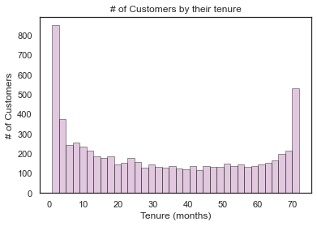
  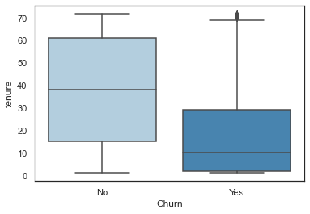

We have a higher number of customers in the first month and in the 72nd month and this may be due to customers with different contract type. The customers who do not churn tend to stay for a longer tenure with the telecom company.

  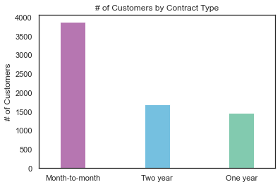
  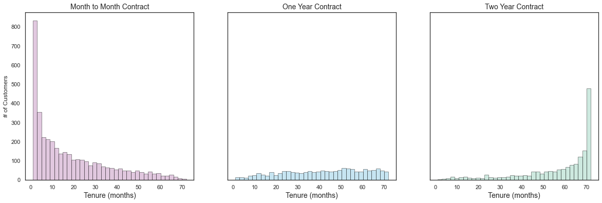

Over half of the customers are in the month to month contract. Most of the monthly contracts last for 1-2 months, while the 2 year contracts tend to last for about 70 months. This shows that the customers taking a longer contract are more loyal to the company and tend to stay with it for a longer period of time.

  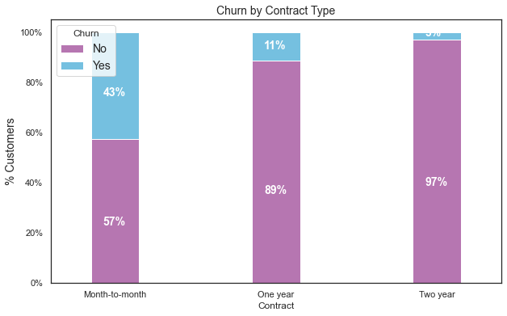
  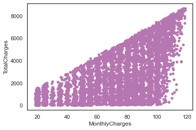
  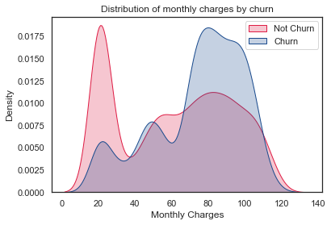
  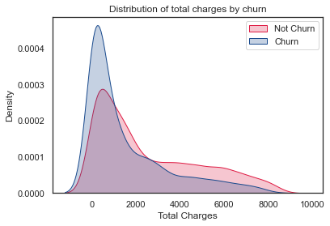

The customers who have a month to month contract have a very high churn rate and there is a positive relationship between monthly charges and total charges. Higher % of customers churn when the monthly charges are high and there is higer churn when the total charges are lower.

## C. Services Information

  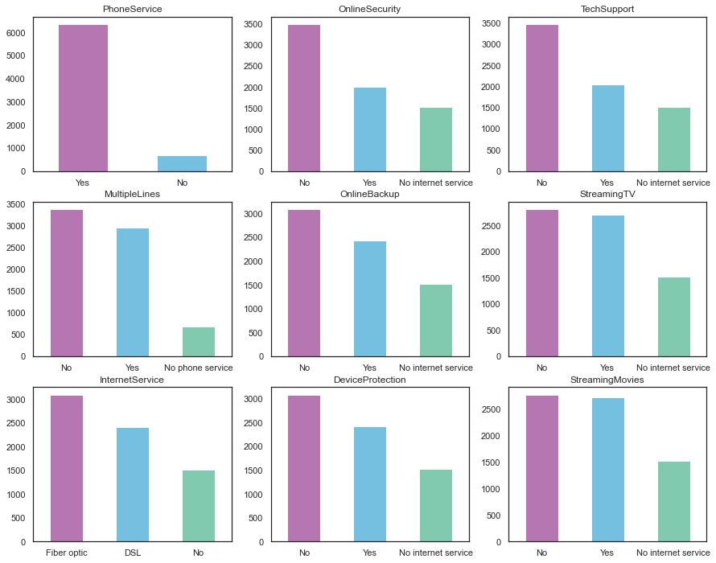

# Data Preparation
## A. Resampling
As the response variable is imbalanced, a bias in the training data can lead poor performance in prediction with the models. To handle this imbalanced problem, what I did is up-sampling the minority class.

## B. Scaling
Since some of machine learning methods (E.g. SVM) try to maximize the distance between the separating plane and the support vectors, if one feature  has very large values, it will dominate the other features when calculating the distance. For this reason, I rescaled all features so that they all have the same influence on the distance metric.

# Modeling
## A. Logistic Regression -- baseline model

Accuracy: 0.7517
Precision: 0.7356
Recall: 0.7874
F1 Score: 0.7606
ROC_AUC: 0.7516

  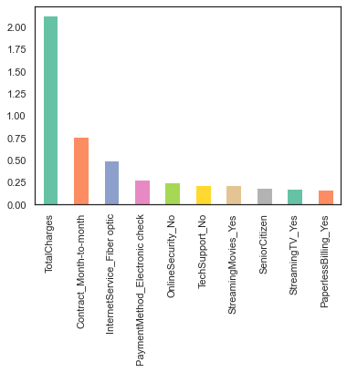
  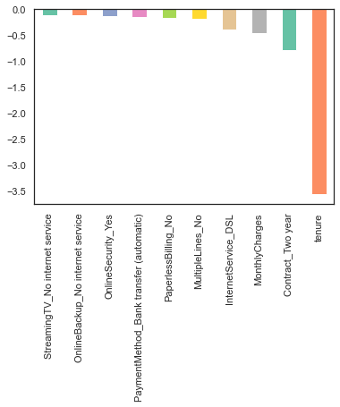

Total charges, monthly contracts and fiber optic internet services can lead to higher churn rates. On the other hand, having a 2-year contract along with tenure has the most negative relation with Churn. Having DSL internet service also reduces chances of churn.

## B. Random Forest

Accuracy: 0.7638
Precision: 0.7462
Recall: 0.801
F1 Score: 0.7726
ROC_AUC: 0.7637

  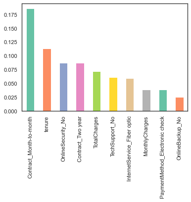

Monthly contract, tenure and total charges are the most important predictor variables to predict churn. The results from random forest are very similar to that of the logistic regression and in line to what we had expected from our EDA.

## C. Support Vector Machine (SVM)

Accuracy: 0.7372
Precision: 0.6994
Recall: 0.8338
F1 Score: 0.7607
ROC_AUC: 0.737

  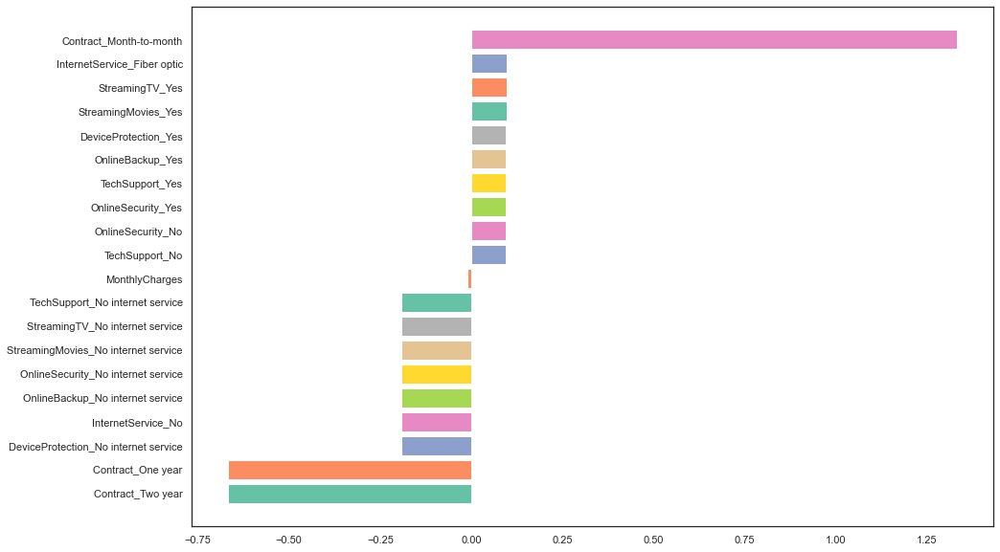

The accuracy rate decreases to 73% by using SVM model. Monthly contract is the most important predictor variables to predict churn and having a 1-year or 2-year contract has the most negative relation with Churn.

## D. ADA Boost

Accuracy: 0.7585
Precision: 0.7384
Recall: 0.8019
F1 Score: 0.7689
ROC_AUC: 0.7584

  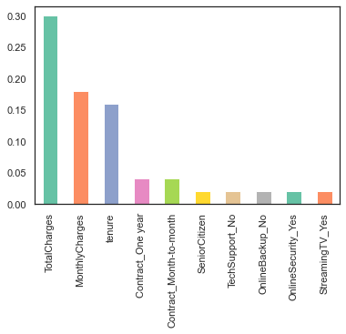

The accuracy rate increases up to 76% by using ADA Boost model. Total charges, monthly charges and tenure are the most important predictor variables to predict churn.

## E. XG Boost

Accuracy: 0.8504
Precision: 0.8097
Recall: 0.9169
F1 Score: 0.86
ROC_AUC: 0.8503

  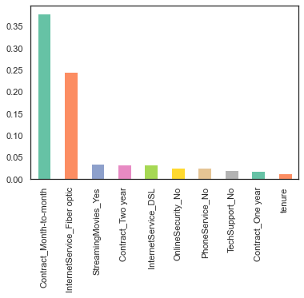

Monthly charges and fiber optic internet service are the most important predictor variables to predict churn.

# Results
## Key foundings and Recommendations

  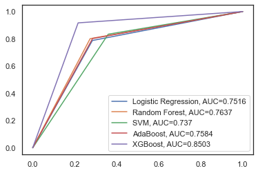

Among the models trained above, the XG Boost model performed the best showing 0.85 accuracy, 0.80 precision, 0.91 recall, 0.86 F1 score and 0.85 ROC AUC. The montly contract, total charges, monthly charges and tenure are the primary features of most of the models which must be considered in the business. Recommendation is to use XG Boost model and it is recommended to plan the limited budget in accordance with the model prediction -- persuading consumers to sign longer term contracts (tenure or two-year contract) and giving consumers huge discounts if they join other services such as fiber optic internet service.

## Potential next steps or further research topics
As there are 20 independent variables, we can check the correlations between predictor variables and consider trying to remove predictor variables with high collinearity.
