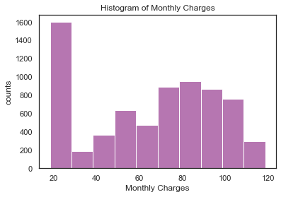

# Business Question
How to best predict which customers are going to churn so that the telecom company can proactively go to them and provide them better services beforehand

# Dataset
Data has been retreived from [Kaggle](https://www.kaggle.com/datasets/blastchar/telco-customer-churn) and it is orginated from [IBM](https://www.ibm.com/docs/en/cognos-analytics/11.1.0?topic=samples-telco-customer-churn). This dataset tracks a fictional telecom company's customer churn based on various factors : 19 independent variables including customers' demographic information, account information, and services information. The dataset consists of 7043 customer data and the response variable `Churn` indicates whether the customer departed or not.

# Exploratory Data Analysis

  
  
  
  

After checking of missing data, there were 11 missing values in the response variable `Churn` and I removed them. Among 19 features, only 2 were numerical and 17 were categorical variables. Plotting the numerical variables, both features were right-skewed distributed, but I have decided not to make any transformation or manipulation since they were good enough and without transformation we can keep the interpretation simpler. Constructing a correlation plot of `Churn` with other independent variables, tenure and two year contracts seem to be negatively correlated with churn. On the other hand, month to month contracts, absence of online security and tech support seem to be positively correlated with churn.

## A. Demographics

  

  
  

  

  
  

Analyzing demographic variables, about half of the customers in our dataset are male while the other half are female. Most of our customers in the data set are younger people and senior citizens have almost double the churn rate than younger population. About 50% of the customers have a partner, while only 30% of the total customers have dependents. Among the customers who have a partner, only about half of them also have a dependentd. Among the customers who do not have any partner, a majority of them do not have any dependents.

## B. Customer Account Information

IMAGES 10~16

## C. Services Information

# Data Preparation
## A. Resampling
## B. Scaling

# Modeling
## A. Logistic Regression -- baseline model

## B. Random Forest

## C. Support Vector Machine (SVM)

## D. ADA Boost

## E. XG Boost

# Results
## Key foundings and Recommendations

## Potential next steps or further research topics
